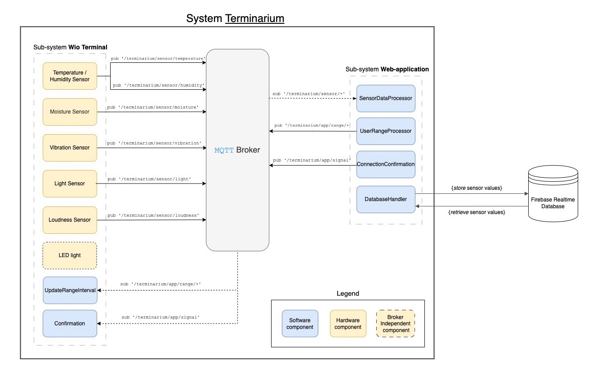

# Terminarium


### Table of Contents

- [Terminarium](#terminarium)
    - [Table of Contents](#table-of-contents)
  - [Synopsis \& Motivation](#synopsis--motivation)
  - [Dependencies \& Requirements](#dependencies--requirements)
  - [Installation](#installation)
  - [Usage](#usage)
    - [Demo and Examples](#demo-and-examples)
  - [System design](#system-design)
  - [Acknowledgements](#acknowledgements)
  - [Contributing](#contributing)
  - [License](#license)
    - [Team members](#team-members)

The project is entitled _"Terminarium"_, a portmanteau derived from the words __Terrarium__ and __Terminal__ that represents the interplay between the physical components of our integrated system; environmental data is collected from within a terrarium physical sensors that are connected to a terminal

## Synopsis & Motivation

The project is an __all-in-one integrated__ system for monitoring the environment of terrariums and other kinds of bioactive enclosures. Through the use of sensors contained in the enclosure and connected to a terminal, environmental measurements are conveyed to a __web-based user interface__ which communicates both raw and processed data and analytics. This will enable users to stay informed about the conditions of their terrarium remotely.

Furthermore, the system will _notify_ the user in the event of an __emergency__ where environmental conditions fall outside of desired limits. These can either be user-defined or based on a specific preset. The system is designed to be easily expandable and customizable to fit the needs of the user.

## Dependencies & Requirements

The following section lists the __dependencies and requirements__ for the project; these should be installed prior to the installation process described in the section afterwards.

1. [Wio Seeed Terminal](https://www.seeedstudio.com/Wio-Terminal-p-4509.html) (or compatible alternative board)
2. [Arduino IDE](https://www.arduino.cc/en/software) or [Arduino CLI](https://github.com/arduino/arduino-cli) (for `CLI` usage)
3. Wio Terminal Board Library (parsed from [link](https://files.seeedstudio.com/arduino/package_seeeduino_boards_index.json))
4. Grove Temperature And Humidity Sensor (accessed on [GitHub](https://github.com/Seeed-Studio/Grove_Temperature_And_Humidity_Sensor))
5. Wio Terminal **Grove Sensors**:
   - the list of required sensors can be viewed in the [`TODO` Section](https://git.chalmers.se/courses/dit113/2023/group-15/terminarium/-/wikis/Requirements,-System-Sensors#(Initial)%20List%20of%20Requirements) of the project's **wiki** page.
6. <...>

## Installation

The following sections contains the required steps of the installation process.

```sh
$ # TODO: provide installation instructions
$ <...>
$ <...>
```

## Usage

TODO: the usage instructions shall be provided here.

> Consider providing a __detailed__ description of the usage with the use of graphics and/or diagrams, screenshots, etc.

### Demo and Examples

TODO: provide a __demo__ of the system's usage.

> Consider providing a video rendition of the system's usage given a specific scenario (i.e. a user's interaction with the system).

## System design

The __system's design__ is depicted in the following diagram (with an additional legend):



\*view the __diagram__ in an __uncompressed__ form (full quality): [link](https://tinyurl.com/dit113-init-system-design)

## Acknowledgements

TODO: provide a list of acknowledgements that are relevant to the project.

## Contributing

TODO: provide the contributing guidelines, these ought to be spcified via the `CONTRIBUTING.md` file of the repository.

## License

TODO: provide the license of the project, this ought to be spcified via the `LICENSE` file of the repository.

### Team members

- Manely Abbasi (@manely)
- Erik Lindstrand (@elindstr)
- Michal Spano (@spano)
- James Klouda (@klouda)
- Konstantinos Rokanas (@rokanas)
- Jonathan Boman (@bomanjo)

Moreover, the team members have used the following `CODE_OF_CONDUCT.md` file as a reference: [link](https://git.chalmers.se/courses/dit113/2023/group-15/terminarium/-/blob/main/CODE_OF_CONDUCT.md).

___

<p align="left">
    
    
    
    
    
    
</p>

_Terminarium 2023_, `DIT113`, University of Gothenburg | Chalmers University of Technology, Sweden
