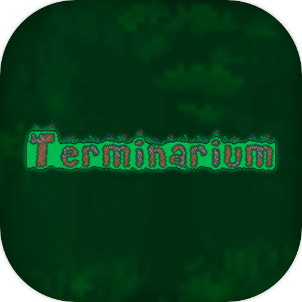
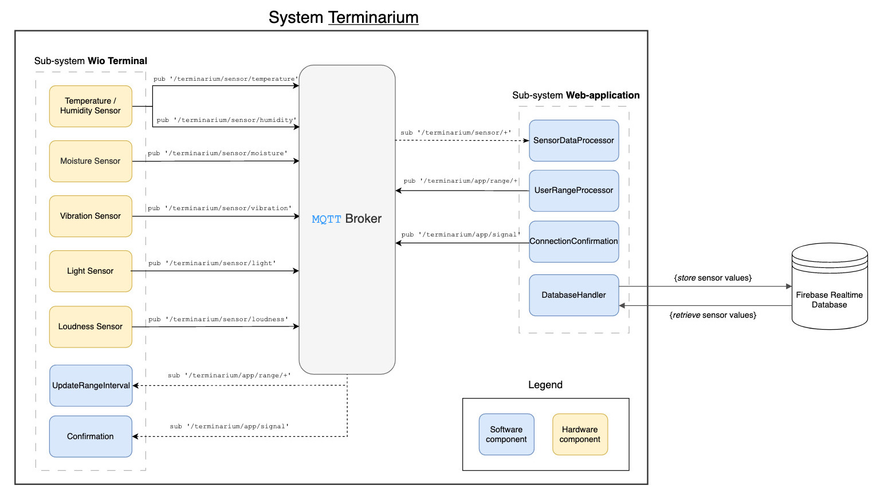

# Terminarium



### Table of Contents

- [Terminarium](#terminarium)
    - [Table of Contents](#table-of-contents)
  - [Synopsis \& Motivation](#synopsis--motivation)
  - [Dependencies \& Requirements](#dependencies--requirements)
  - [Installation](#installation)
    - [Installation Process - `Wio Terminal`](#installation-process---wio-terminal)
    - [Web-based Application - Local Installation](#web-based-application---local-installation)
  - [Usage](#usage)
    - [`Wio` Terminal - Usage](#wio-terminal---usage)
      - [1. `Arduino IDE` - Usage](#1-arduino-ide---usage)
      - [2. Automated `Shell` Script - Usage](#2-automated-shell-script---usage)
    - [Web-based Application - Live Demo](#web-based-application---live-demo)
    - [Web-based Application - Local Usage](#web-based-application---local-usage)
    - [Demo and Examples](#demo-and-examples)
  - [System design](#system-design)
  - [Acknowledgements](#acknowledgements)
  - [Contributing](#contributing)
  - [License](#license)
    - [Team members](#team-members)

The project is entitled _"Terminarium"_, a portmanteau derived from the words __Terrarium__ and __Terminal__ that represents the interplay between the physical components of our integrated system; environmental data is collected from within a terrarium physical sensors that are connected to a terminal

## Synopsis & Motivation

The project is an __all-in-one integrated__ system for monitoring the environment of terrariums and other kinds of bioactive enclosures. Through the use of sensors contained in the enclosure and connected to a terminal, environmental measurements are conveyed to a __web-based user interface__ which communicates both raw and processed data and analytics. This will enable users to stay informed about the conditions of their terrarium remotely.

Furthermore, the system will _notify_ the user in the event of an __emergency__ where environmental conditions fall outside of desired limits. These can either be user-defined or based on a specific preset. The system is designed to be easily expandable and customizable to fit the needs of the user.

## Dependencies & Requirements

The following section lists the __dependencies and requirements__ for the project; these should be installed prior to the [installation process](#installation) described in the section afterwards.

1. [Wio Seeed Terminal](https://www.seeedstudio.com/Wio-Terminal-p-4509.html) (or compatible alternative board)
2. [Arduino IDE](https://www.arduino.cc/en/software) or [Arduino CLI](https://github.com/arduino/arduino-cli) (optional: for [`CLI` usage](#2-automated-shell-script---usage))
3. Wio Terminal **Board Library** (parsed from [link](https://files.seeedstudio.com/arduino/package_seeeduino_boards_index.json)); more information can be found [here](https://wiki.seeedstudio.com/Wio-Terminal-Getting-Started/#getting-started)
4. A collection of `Arduino` libraries$^*$:
   - [DHT-Sensors-Non-Blocking](https://github.com/toannv17/DHT-Sensors-Non-Blocking) library, Toan Nguyen
   - [TFT_eSPI](https://github.com/Bodmer/TFT_eSPI), Bodmer
   - [rpcWifi](https://github.com/Seeed-Studio/Seeed_Arduino_rpcWiFi), Hontai Liu / Seeed
   - [PubSbClient](https://pubsubclient.knolleary.net/), Nick O'Leary
   - [FlashStorage_SAMD](https://github.com/khoih-prog/FlashStorage_SAMD), Khoih Prog & Cristian Maglie
5. Wio Terminal **Grove Sensors**:
   - the list of the required sensors can be obtained from [link](https://git.chalmers.se/courses/dit113/2023/group-15/terminarium/-/wikis/home#System%20Sensors).
6. [`Node.js`](https://nodejs.org/en) and `npm` (the `Node` Package Manager) for the web-based application (it is required to go with the latest stable version of `Node.js`)
   - `Node.js` comes pre-packaged with `npm`, so there's no need to install `npm` separately.
   - All the required dependencies for the web-based application are listed in the [`package.json`](https://git.chalmers.se/courses/dit113/2023/group-15/terminarium/-/blob/main/src/web/terminarium-web/package.json) file and no additional packages and/or global dependencies are required to be installed.
7. [`Git`](https://git-scm.com/downloads) is required to be installed in order to clone the repository

$^*$Note: despite our best efforts, we were unable to find a solution how to **automate** the process of installing the required `Arduino` libraries. Therefore, the user is required to install the libraries manually via the `Arduino IDE`. For additional guidance, please refer to the [Arduino Library Manager](https://support.arduino.cc/hc/en-us/articles/5145457742236-Add-libraries-to-Arduino-IDE) documentation.

## Installation

The following sections contains the required steps of the installation process.

### Installation Process - `Wio Terminal`

As indicated previously, the required libraries are to be installed manually via the `Arduino IDE`. The following steps are required to install the libraries:

1. Open the `Arduino IDE` and navigate to `Tools > Manage Libraries...`
2. Install the required libraries by searching for the library name (from the list [Dependencies & Requirements](#dependencies--requirements) point 4) in the search bar and clicking on the `Install` button.
   - It is recommended to download the latest version of the library.

### Web-based Application - Local Installation

Our project makes use of `Node.js` and `npm` (the `Node` Package Manager) to install the required dependencies for the web-based application. The following steps are required to install the dependencies:


```sh
# Assuming that the user is in the root directory of the project
# and cloned the repository with the following command: 
git clone <repository-url>

# 0. Navigate to the source of the website
cd src/web/terminarium-web

# 1. Install all the required dependencies
npm install
```

However, there's an extra step required in order to make use of **Firebase Realtime Database**. In short, an `.env` file is to be **created** in the `src/web/terminarium-web` directory with the following contents:

```sh
# .env file - access to the Firebase Realtime Database
VITE_API_KEY="<API_KEY>"
VITE_AUTH_DOMAIN="<AUTH_DOMAIN>"
VITE_DATABASE_URL="<DATABASE_URL>"
VITE_PROJECT_ID="<PROJECT_ID>"
VITE_STORAGE_BUCKET="<STORAGE_BUCKET>"
VITE_MESSAGING_SENDER_ID="<MESSAGING_SENDER_ID>"
VITE_APP_ID="<APP_ID>"
VITE_MEASUREMENT_ID="<MEASUREMENT_ID>"
```

These credentials can be obtained from the [Firebase Console](https://console.firebase.google.com).

<details>
<summary>Miscellaneous</summary>

  By having the `.env` file in place, the web-based application will be able to connect to the **Firebase Realtime Database**, and thus, the user will be able to view the data that is being collected from the sensors, and so on.

  > __Observe:__ `Vite.js` is responsible for distributing the `env` variables, and no external packages are required to be installed in order to make use of the `.env` file. For more information, please refer to the [**Vite.js**](https://vitejs.dev/guide/env-and-mode.html#env-files) documentation.

</details>


## Usage

### `Wio` Terminal - Usage

There's two main ways how to get started with the `Wio` Terminal with our project and they are covered in this subsection.

#### 1. `Arduino IDE` - Usage

Having followed the [Installation Process](#installation-process---wio-terminal) section, the user can simply:
1. Open the `Arduino IDE` and navigate to `File > Open...`
2. Open the `terminarium` folder (`src/wio/terminarium`) and select the `terminarium.ino` file from the directory
3. **Upload** the sketch to the `Wio` Terminal by clicking on the `Upload` button
   1. The `Wio` Terminal is required to be connected to the computer via the `USB` cable
   2. To open the `Serial Monitor`, navigate to `Tools > Serial Monitor` and select the `9600 baud` option.

#### 2. Automated `Shell` Script - Usage

Who loves automation? _We do!_ Therefore, we have created a `shell` script which is a `wrapper` for the `Arduino CLI` and it is located in the `src/sh` directory. The following steps are required to run the script:

```sh
# 0. Navigate to the source from the root
cd src/

# 1. View the usage of the script (help flag)
./sh/terminarium.sh -h 
./sh/terminarium.sh --help
```
```txt
Usage: terminarium.sh [port] [+options]
  port: the port where the Arduino board is connected to
  options:
    --list-ports, -lp: list all the available ports
    --help, -h: show the usage
```
```sh
# 2. List all the available ports
./sh/terminarium.sh -lp
./sh/terminarium.sh --list-ports

# 3. Run the script with the desired port destination
#   (the port is required to be connected to the computer)
#   (replace <XXXX> with the port number obtained from the previous step)
./sh/terminarium.sh /dev/cu.usbmodem<XXXX>

# 4. To stop the script, press CTRL + C in the terminal
# 5. Enjoy!
```

Furthermore, this `script` emulates the **Serial monitor** right in your terminal instance. Therefore, the user is able to view the data that is being collected from the sensors, and so on. Is that not cool? _We think it is!_

**Note:** the following script is only available for `Unix` based systems, such as `Linux` and `macOS`. However, the script can be easily modified to work with `Windows` based systems.

### Web-based Application - [Live Demo](https://terminarium.netlify.app/)

The **website application** is deployed via `Netlify`; a **report** of the deployment can be found [here](https://git.chalmers.se/courses/dit113/2023/group-15/terminarium/-/wikis/Sprint-3-Challenges).

### Web-based Application - Local Usage

There's an opportunity to run the web-based application locally. The following steps are required to engage with the application locally:

```sh
# Assuming that the user is terminarium-web directory
# 0. Navigate to the source of the website
cd src/web/terminarium-web

# 1. Run the application locally
npm run dev

# 2. Open the browser with the localhost:XXXX address
#    (the port number is displayed in the terminal)

# 3. To stop the application, press CTRL + C in the terminal
```

<details>
<summary>Additional Utilities</summary>

All the additional commands, such as for **testing**, **linting**, etc. can be found in the [`package.json`](https://git.chalmers.se/courses/dit113/2023/group-15/terminarium/-/blob/main/src/web/terminarium-web/package.json) file.

</details>

### Demo and Examples

As part of the project's delivery, the following **video** was created to demonstrate the core functionality of the system:

[`Terminarium` - Project Demo](https://youtu.be/oMgfVUPOEtc)

<details>
<summary>Terminarium <code>CLI</code> Demo</summary>

  The following video demonstrates the usage of the `Terminarium CLI`:

  [`Terminarium CLI` - Demo](https://youtu.be/Gz2omDNVtLk)

</details>


## System design

The __system's design__ is depicted in the following diagram (with an additional legend):



\*view the __diagram__ in an __uncompressed__ form (full quality): [link](https://tinyurl.com/dit113-final-system-design)

## Acknowledgements

**Contributors:** refer to the section ['Team Members'](#team-members) for more information.

**Frameworks and open-source libraries:**

- `Vue.js`: Credits to the authors and maintainers of the `Vue.js` framework. `Vue` facilitated the tools we needed to develop the UI for the project. Similarly, to `Node.js` and `npm` (the `Node` Package Manager) for the web-based application.
- `Firebase Realtime Database` by Firebase Inc.
- Credit it due to the authors and maintainers of the open-source libraries used in the project regarding the `Wio Terminal` and `Arduino` programming.

<details>
<summary>Additional acknowledgements</summary>

**Sponsors:**

We would like to acknowledge **University of Gothenburg | Chalmers** for supplying hardware and other resources for the project.

**Special thanks:**

To TAs (Teaching Assistants), Amin Mahmoudifard and Bao Quan Lindgren, we pay special tribute for providing guidance and wisdom throughout the development experience.

</details>

## Contributing

The contributing guidelines for the Terminarium project should be adhered to by all contributors as specified by the guidelines in the document: [`CONTRIBUTING.md`](https://git.chalmers.se/courses/dit113/2023/group-15/terminarium/-/blob/1f8d174c6a9bcaf00cedd0d7cce114d175203101/CONTRIBUTING.md).

## License

The project is licensed under the MIT License. Refer to the [`LICENSE`](https://github.com/michalspano/terminarium/blob/main/LICENSE) file for more information.

### Team members

- **Manely Abbasi (@manely)**: Made significant contributions to User Interface (UI) development and the design of the Website-based application.
- **Erik Lindstrand (@elindstr)**: Made significant contributions to the User Interface (UI) development of the Website-based application.
- **Michal Spano (@spano)**: Provided extensive knowledge in project development and led the team as project manager. Michal supervised and contributed across the whole system on both the hardware and software side.
- **James Klouda (@klouda)**: Made significant contributions to the User Interface (UI) development of the Website-based application.
- **Konstantinos Rokanas (@rokanas)**: Made significant contributions to the Back-End with a special focus on the Wio terminal.
- **Jonathan Boman (@bomanjo)**: Made significant contributions to the Back-End utilities related to the Wio terminal and the Website-based application.

The team members have used the following `CODE_OF_CONDUCT.md` file as a reference: [link](https://git.chalmers.se/courses/dit113/2023/group-15/terminarium/-/blob/main/CODE_OF_CONDUCT.md).

___

<p align="left">
    
    
    
    
    
    
</p>

_Terminarium 2023_, `DIT113`, University of Gothenburg | Chalmers University of Technology, Sweden
