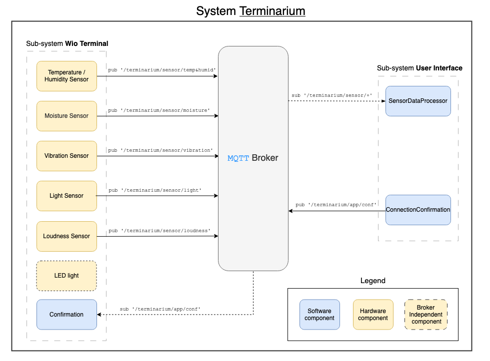

# Project Video

## Project's name

The project is entitled _"Terminarium"_, a portmanteau derived from the words __Terrarium__ and __Terminal__ that represents the interplay between the physical components of our integrated system; environmental data is collected from within a terrarium physical sensors that are connected to a terminal.

## Purpose of the project

The project is an __all-in-one integrated__ system for monitoring the environment of terrariums and other kinds of bioactive enclosures. Through the use of sensors contained in the enclosure and connected to a terminal, environmental measurements are conveyed to a __web-based user interface__ which communicates both raw and processed data and analytics. This will enable users to stay informed about the conditions of their terrarium remotely.

Furthermore, the system will _notify_ the user in the event of an __emergency__ where environmental conditions fall outside of desired limits. These can either be user-defined or based on a specific preset. The system is designed to be easily expandable and customizable to fit the needs of the user.

## Intended usage

*User* is a commuting worker and an avid keeper of exotic animals. Today, they have brought home yet another tarantula as a pet. They have prepared an enclosure and, as a responsible pet owner, they have done their research regarding the optimal living conditions under which this species thrives. However, with every new pet they take home, problems amass:

*User* has a large number of animals under his care, and maintaining optimal conditions in each terrarium is complicated and confusing. It is usually difficult to discern whether conditions are even suboptimal at all. This problem is further compounded by each animal having differing needs regarding factors like temperature, humidity, light, sound and vibration levels in their habitats. Lastly, *user's* long periods of absence due to their commuting means they cannot check on the living conditions of their beloved creatures regularly throughout the day.

*User* therefore requires a system that facilitates carrying out their duty to provide uncompromising care. For this reason, *user* decides to use the __Terminarium__ system. Installation initially involves placing the physical sensors inside the animals' enclosures, which record the conditions inside the terrariums and continuously broadcast that environmental data to the __Terminarium__ software's user interface. From this UI, __Terminarium__ enables *user* to thoroughly monitor the exact living conditions experienced by each animal, from any place and at any time of day, simply with a few clicks.

Furthermore, __Terminarium__ eases *user's* job by no longer requiring them to memorize the exact requirements for their entire menagerie; the software can remember for them. Upper and lower boundaries for optimal and suboptimal environmental readings can be programmed by *user* into the software, and they are notified in the event that these fall or rise to a level dangerous to the animal. This way, *user* can spend the day far from home and remain reassured that, in the case of any emergency, they will be made aware and can act immediately.

Thus, monitoring becomes simple, problems become substantially more detectable, and ultimately, caring for the animals is streamlined.

## Initial System design

The __initial system's design__ is depicted in the following diagram (with an additional legend):

